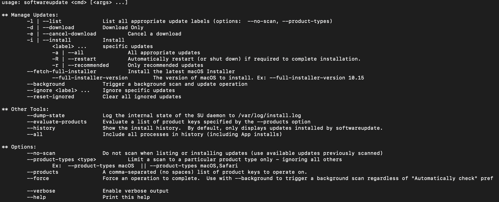

## MacBook Development Environment Setups (OS Catalina : 10.15 & Big Sur: 11.1 )
**Primary Installation Steps**

*Xcode tools*: 
`xcode-select —install`

*Homebrew*: 

[HomeBrew](https://brew.sh/) is an Open-Source software pakage manager. It is Very handy and essential for mac terminal to install\uninstall open source softwares 

`ruby -e "$(curl -fsSL https://raw.githubusercontent.com/Homebrew/install/master/install)"`

basic command for installing softwares via homebrew package manager: 

* `brew install [package_name]`
* `brew uninstall [package_name]` for uninstalling purpose`
* `echo 'export PATH="/usr/local/sbin:$PATH"' >> ~/.zshrc` adding brew to environment path
* `brew update` for updating brew packages to latest version
* `brew info [package_name]` information on the pakages of your interest
* `brew list` or `brew list | grep [pakage_name]` for listing/finding available pakages under `brew`

_NOTE_ if [HomeBrew](https://brew.sh/) installation failed try this - 


```
 rm -rf /usr/local/bin/brew
 rm -rf /usr/local/share/doc/homebrew
 rm -rf /usr/local/share/man/man1/brew.1
 rm -rf /usr/local/share/zsh/site-functions/_brew
 rm -rf /usr/local/etc/bash_completion.d/brew
 rm -rf /usr/local/Homebrew
 ```
[Source](https://stackoverflow.com/questions/39836190/homebrew-install-failed-during-git-fetch-origin-masterrefs-remotes-origin-mas)

*CASK*:

[CASK](https://formulae.brew.sh/cask/) `brew cask` is an extension of `brew` install GUI based application. 

Basic steps for CASK usages - 
* `brew install cask`
* `brew search --casks` this for searching apps under cask`
* `brew search [package_name]`
* `brew cask update` for updating packages
* `brew cask help` for checking advance option for cask

*PYTHON*

`pyenv` is a Open-Source Package Manager for python version control in a single system. Setting up python using `pyenv` in very easy and effective. This will not imapct system python version. You can find the project [here](https://github.com/pyenv/pyenv) on GitHub.
Basic installation steps are - 

*`brew install pyenv` 
* `pyenv` should print current version `1.2.20` *(as of today)*
* `pyenv install --list` or `pyenv install -list | grep -ow 3.8.5` just to check if latest version of python [release](https://www.python.org/downloads/mac-osx/) is available with `pyenv`
* `pyenv install [version_name]` e.g. `3.8.5`
* Finally check available version(s) with `pyenv` by `pyenv versions`

To know more about `pyenv` please refer [here](https://realpython.com/intro-to-pyenv/#using-pyenv-to-install-python)

Next step after installing python with `pyenv` is to install another popular package manager `pipenv`. It is a package manager for handling python libraries 

Basic installation can be done by - 
* `brew install pipenv`
* `pipenv -version` should return latest version `2020.8.13`. This should also install lastest `python3` to mac by default and `pip3`

To know more please refer [here](https://pipenv-fork.readthedocs.io/en/latest/)

*Adding `pyenv` into the `$PATH`*

```
echo 'export PYENV_ROOT="$HOME/.pyenv"' >> ~/.zshrc[.bash_profile]
echo 'export PATH="$PYENV_ROOT/bin:$PATH"' >> ~/.zshrc[.bash_profile]
echo 'eval "$(pyenv init -)"' >> ~/.zshrc[.bash_profile]

```
Quick Intro from [Real Python](https://realpython.com/intro-to-pyenv/)
*Other Utilities*

If you are a [Linux](https://www.linux.org/) user, you must have used `htop` for inspecting CPU usages. Well you can use the same in Mac as well.

to install `htop` - `brew install htop`
`run` by `sudo htop` as this application will need to access hardware info from the kernals 


Another must have utility is `SPEEDTEST`. I use it all the time via browser. But `CLI` application is much cooler. 
to install `speedtest` - `brew install speedtest-cli`
`run` by `speedtest-cli`


Software Updates checking via commandline - 
`softwareupdate`
 

Updating App Store Application from command line - 
- `brew install mas`
- Type `mas` to check other command options available with `mas`


## References: 

1. https://apple.stackexchange.com/questions/125468/what-is-the-difference-between-brew-and-brew-cask
2. https://www.youtube.com/watch?v=Ym2pxzWpTNw&ab_channel=SnazzyLabs
3. https://www.chrisjmendez.com/2017/08/03/installing-multiple-versions-of-python-on-your-mac-using-homebrew/
4. https://www.chrisjmendez.com/2016/01/10/installing-homebrew-on-mac-os-x/
5. https://realpython.com/intro-to-pyenv/#using-pyenv-to-install-python
6. https://pipenv-fork.readthedocs.io/en/latest/
7. https://www.applegazette.com/mac/update-mac-apps-using-terminal/

